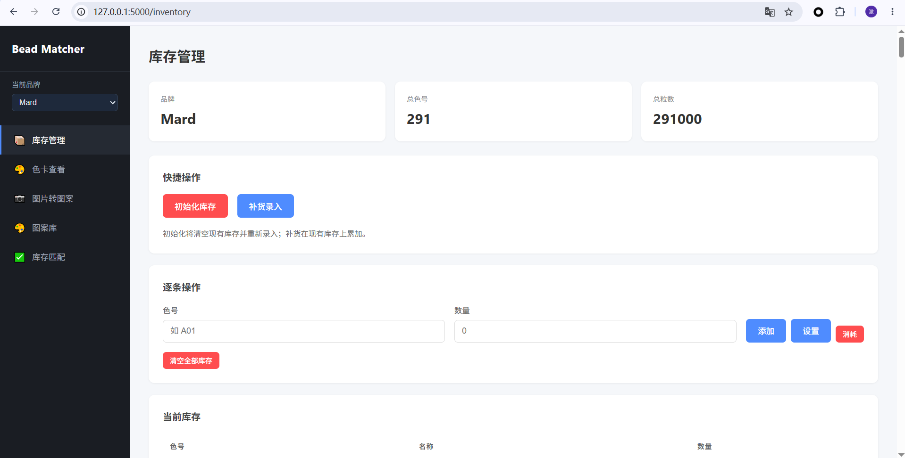
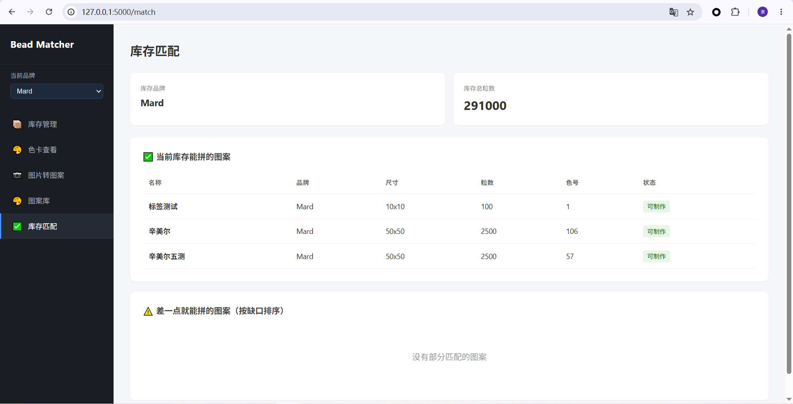
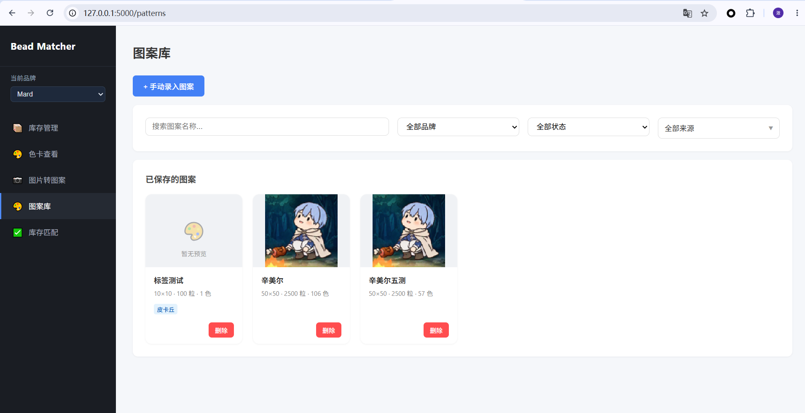
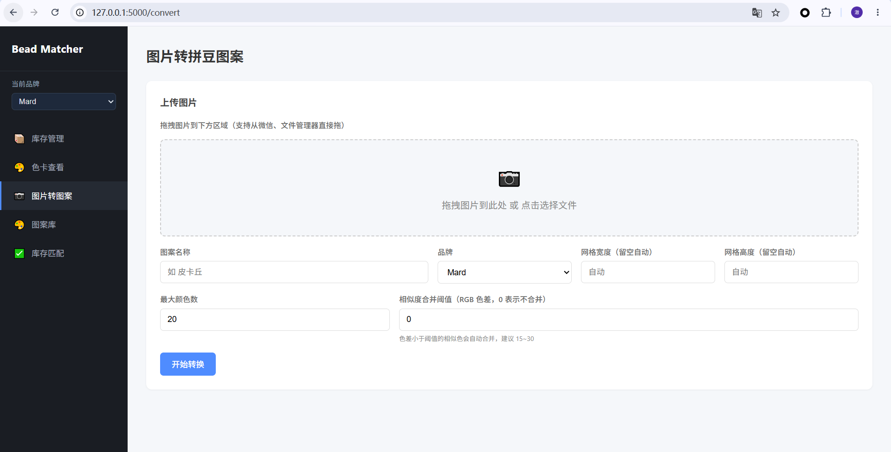
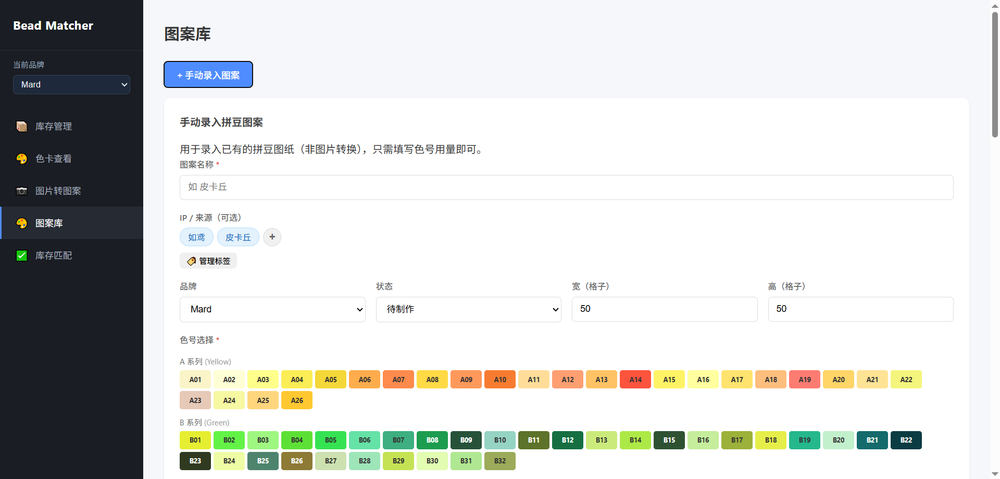
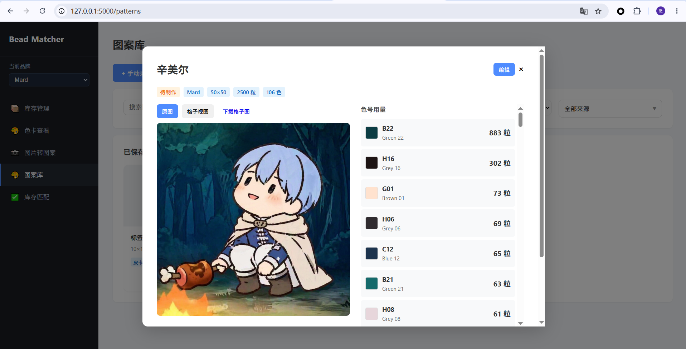

# Bead Matcher

拼豆库存管理与反向匹配工具。

用户录入现有豆子库存（色号 + 数量），系统反向推荐库存能覆盖的图案，并支持图片转拼豆图案、AI 识图、制作记录追踪等功能。

## 特性

- **三端支持**：PyQt6 桌面 GUI、Flask Web、命令行 CLI
- **品牌色卡**：内置 Mard 221 色完整色卡（2.6mm 融合拼豆），后端预留多品牌扩展
- **库存管理**：初始化向导式批量录入、补货录入、逐条操作、事务流水、撤销
- **图案库**：图片转拼豆图案（最近色匹配）、OCR / 像素 / AI 三种识图模式、手动录入已有图纸
- **反向匹配**：自动筛选库存能完全覆盖的图案，显示缺口分析
- **制作记录**：追踪每次制作消耗，支持一键撤销
- **手动录入图案**：支持已有拼豆图的手动录入（色号用量 + IP 标签 + 状态追踪）
- **拖拽上传**：GUI / Web 端均支持图片拖拽上传（兼容微信、文件管理器直接拖入）
- **数据持久化**：SQLite 数据库，支持库存快照与制作历史

## 界面预览

| Web 首页 | 库存管理 |
|:---:|:---:|
|  |  |

| 图案库 | 图案转拼豆图 |
|:---:|:---:|
|  |  |

| 手动录入图案 | 图案详情弹窗 |
|:---:|:---:|
|  |  |

## 项目结构

```
bead-matcher/
├── bead_matcher/          # 核心模块
│   ├── color_chart.py     # 品牌色卡定义
│   ├── inventory.py       # 库存模型
│   ├── pattern.py         # 图案模型
│   ├── pattern_converter.py   # 图片转拼豆图案
│   ├── image_analyzer.py  # OCR / 像素识图
│   ├── vision_analyzer.py # AI 视觉识图（Kimi）
│   ├── inventory_service.py   # 制作/撤销等业务逻辑
│   ├── db.py              # SQLite 数据库与 Schema
│   ├── dao/               # 数据访问层
│   │   ├── inventory_dao.py
│   │   ├── pattern_dao.py
│   │   └── make_record_dao.py
│   ├── storage.py         # 库存兼容层
│   ├── pattern_storage.py # 图案库兼容层
│   └── cli.py             # 命令行入口
├── gui/                   # PyQt6 桌面客户端
│   ├── main_window.py
│   ├── styles.py
│   └── tabs/              # 库存/图案库/匹配/转换/历史
├── web/                   # Flask Web 应用
│   ├── app.py
│   ├── templates/
│   └── static/
├── tests/                 # 单元测试
├── data/                  # SQLite 数据库与缩略图
├── main.py                # 入口脚本（CLI + TUI）
└── requirements.txt
```

## 安装依赖

```bash
pip install -r requirements.txt
```

如需 OCR 识图功能，额外安装：
```bash
pip install pytesseract
# 并安装 Tesseract-OCR 引擎：https://github.com/UB-Mannheim/tesseract/wiki
```

如需 AI 视觉识图，额外安装：
```bash
pip install openai
# 并设置环境变量 KIMI_API_KEY
#   Windows: set KIMI_API_KEY=sk-...
#   Linux/Mac: export KIMI_API_KEY=sk-...
```

## 快速开始

### 1. GUI 桌面客户端（推荐）

```bash
python -m gui.main_window
```

### 2. Web 端

```bash
python web/app.py
# 打开浏览器访问 http://127.0.0.1:5000
```

### 3. 命令行 / 交互菜单

```bash
# 交互菜单（无参数）
python main.py

# CLI 命令
python -m bead_matcher.cli init              # 初始化库存
python -m bead_matcher.cli add A01 1000      # 添加库存
python -m bead_matcher.cli set A01 500       # 设置库存
python -m bead_matcher.cli remove A01 200    # 消耗库存
python -m bead_matcher.cli list              # 查看库存
python -m bead_matcher.cli chart             # 查看色卡
python -m bead_matcher.cli analyze image.png # 分析图片色号
python -m bead_matcher.cli convert image.png "图案名"  # 图片转图案
python -m bead_matcher.cli clear             # 清空库存
```

### 库存初始化示例

```bash
python -m bead_matcher.cli init
# 或在 GUI/Web 中点击「初始化库存」按钮
# 选择需要录入的系列（A~M），批量设置数量后入库
```

## 数据迁移

如有旧的 JSON 数据，可一键迁移到 SQLite：

```bash
python migrate_to_sqlite.py
```

旧文件会自动备份到 `data/backup/`。

## 运行测试

```bash
pip install pytest
python -m pytest tests/ -q
```

## 技术栈

- Python >= 3.10
- Pillow（图像处理）
- PyQt6（桌面 GUI）
- Flask（Web 后端）
- SQLite（数据持久化）
- pytesseract（可选，OCR）
- openai / urllib（可选，AI 视觉）

## 版权说明

本项目为拼豆库存管理工具，色卡数据来源于公开渠道（peiseka.com / doudougongfang.com）。用户自行上传/创建的图案版权归用户所有，请遵守相关平台的使用协议。
